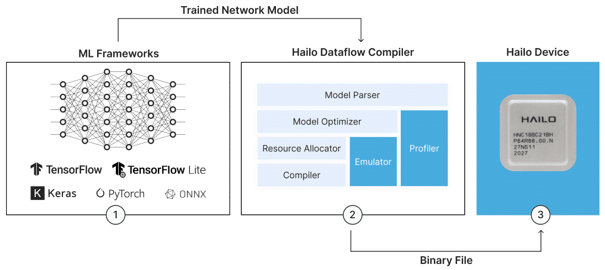

# Hailo Dataflow Compiler (DFC) Installation guide

The Hailo Software suit is used to convert neural nets into .hef (Hailo Execution File). Python 3.10 should be installed.

First install the following packages:

`sudo apt-get install python3.10-dev python3.10-distutils python3-tk graphviz libgraphviz-dev` 

Then create a virtualenv:

`virtualenv Hailodfc`

Enter the virtualenv:

`source Hailodfc/bin/activate`

When inside the virtualenv:

`pip install hailo_dataflow_compiler-3.29.0-py3-none-linux_x86_64.whl`

To test installation view Hailo's CLI tool options with:

`hailo -h`

## Dataflow Compiler Tutorials

Use the following command to open a jupyter server for tutorials:

`hailo tutorial`